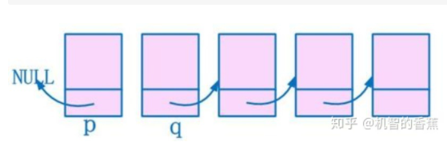

### [快慢指针](https://zhuanlan.zhihu.com/p/38521018)
```java
ListNode slow=head,fast=head;
while(fast.next&&fast.next.next){
    slow = slow.next;
    fast = fast.next.next;
}
```
#### **一、快慢指针寻找链表中点**
- 设置两个指针**fast**、**slow**，slow每次移动一次，fast移动两次
- 链表中节点为偶数时，fast的next节点不为空，slow指针指向中间节点的前一个节点；节点个数为奇数时，fast的next节点为空，slow指向中点节点

[例题](https://leetcode-cn.com/problems/palindrome-linked-list/description/?utm_source=LCUS&utm_medium=ip_redirect_q_uns&utm_campaign=transfer2china)
请判断一个链表是否为回文链表 （O(n)时间复杂度,O(1)的空间复杂度）
```java
/**
 * Definition for singly-linked list.
 * public class ListNode {
 *     int val;
 *     ListNode next;
 *     ListNode(int x) { val = x; }
 * }
 */
class Solution {
    static boolean isPalindrome(ListNode head) {
         if (head == null||head.next==null){
            return true;
        }
        //找中间节点
        ListNode fast=head;
        ListNode slow=head;
        while(true){
            if(fast.next==null){
                break;
            }
            if(fast.next.next==null){
                break;
            }
            slow = slow.next;
            fast = fast.next.next;
        }
        
        slow = slow.next;
        //reverse函数，翻转list
        slow = reverse(slow);
        
        boolean result = true;
        while(slow!=null){
            if (slow.val!=head.val){
                result = false;
                break;
            }
            head = head.next;
            slow = slow.next;
        }
        return result;
    }
}
```
#### **二、翻转链表**
- 设置三个指针p,q,r，将p指向链表开头，q指向第二个节点**
```
p=head;
q=p->next;
```

- **将头节点和第二个节点断开**
```
head->next = NULL;
```


- 循环
  - 1、将q节点的下一个节点设为r
  - 2、将q节点指向前一个节点p
  - 3、p，q，r依次后移
 
```
r = q->next
q-next = p
p=q
q=r
r=q-next
```

